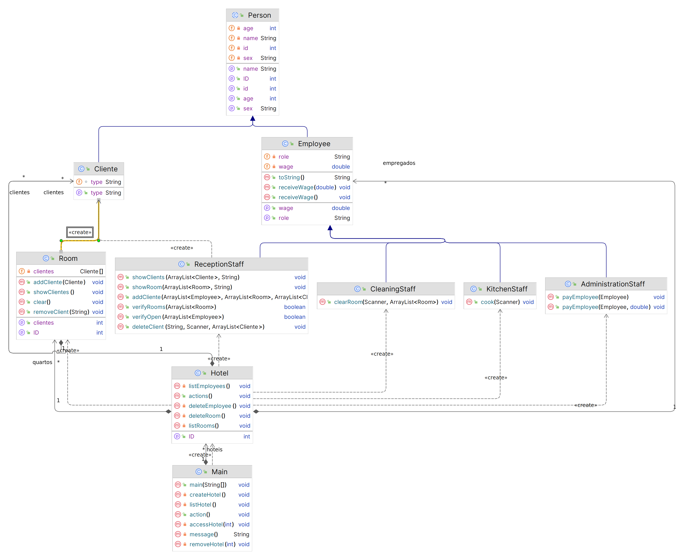

# projeto-final

Conteúdo
---
Este projeto baseia-se em uma estrutura de gerenciamento de hotéis requisitado pelo professor Tércio para conclusão da disciplina de Programação Orientada à Objeto.

Equipe
---
- Jockson Mateus da Silva Duarte
- Jairon José Tavares dos Santos
- Luis Henrique Amorim da Silva

---

Funcionamento
---
No arquivo [Main.java](src/Main.java) é possível gerenciar os hotéis cadastrados.

No arquivo [Hotel.java](src/data/Hotel.java) é possível gerenciar a instância do hotel selecionado, adicionando empregados, quartos e clientes.

Só é possível adicionar clientes caso haja um funcionário em cada funçã. São elas: [AdministrationStaff](src/data/classes/AdministrationStaff.java), [ReceptionStaff](src/data/classes/ReceptionStaff.java), [KitchenStaff](src/data/classes/KitchenStaff.java) e [CleaningStaff](src/data/classes/CleaningStaff.java); e pelo menos um quarto disponível.

Criar um cliente só é possível por uma instância de [ReceptionStaff.java](src/data/classes/ReceptionStaff.java). Como este é um trabalho apenas para entender o funcionamento da programação orientada a objetos, esta é a única classe que realmente tem uma função. As outras classes ainda podem ser utilizada e têm funções, mas não interagem com a classe pai de uma forma significativa.

---

Diagrama UML
---

